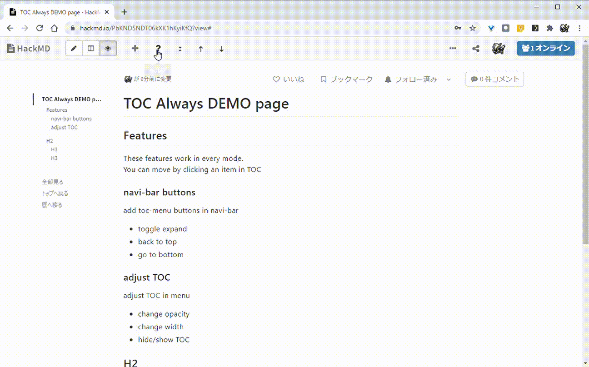
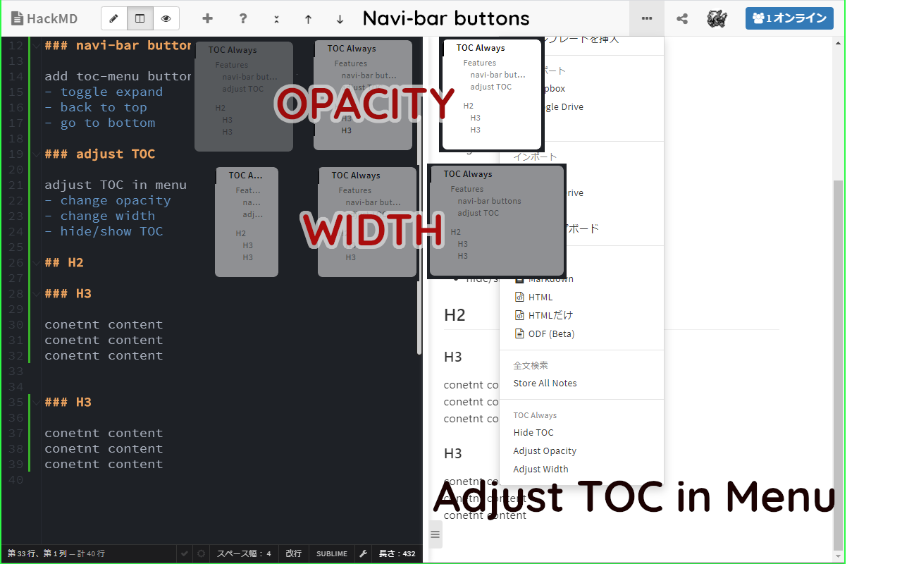

# HackMD_TOC_always

## Abstract

With this extension in HackMD, you can see TOC even in edit or split-view mode.

## Features
These features work in every mode.
You can move by clicking an item in TOC

### navi-bar buttons
add toc-menu buttons in navi-bar
    - toggle-expand / back-to-top / go-to-bottom

### adjust TOC
adjust TOC in menu
- change opacity
- change width
- hide/show TOC

### Problems

- ~~additional buttons in navi bar don't work in Edit mode (because they are from components in view-area)~~
- ~~if click content of TOC in edit mode, the window won't move it. (This is bacuase of the default feature of CodeMirror)~~

## License

MIT
