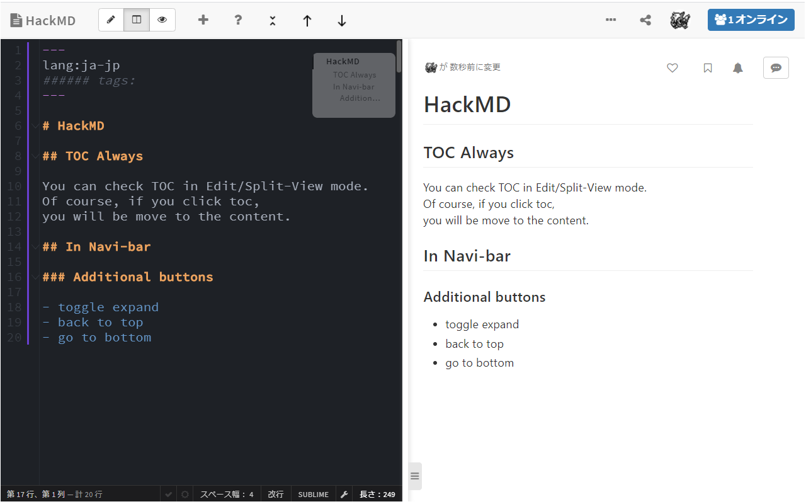
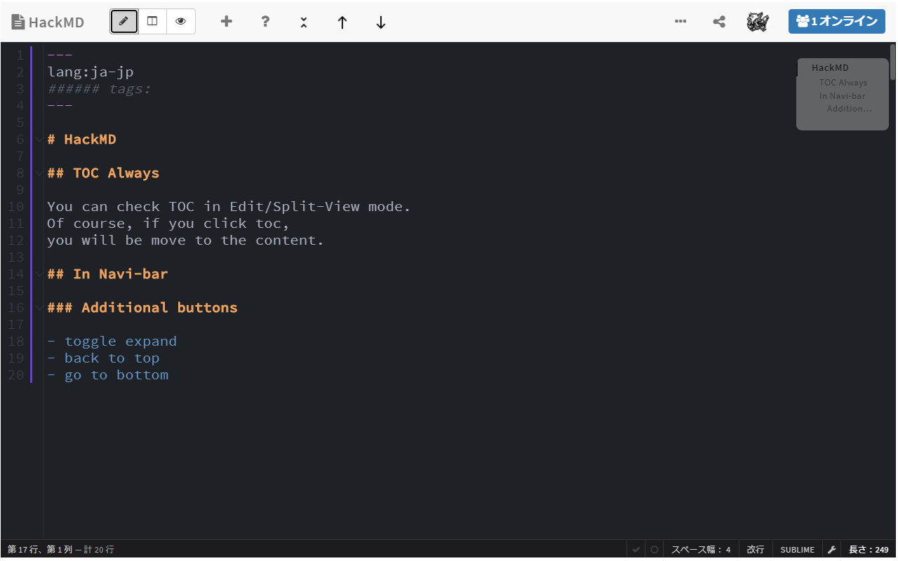

# HackMD_TOC_always

## Abstract

This extension can enable you to view HackMD's TOC in sidebar even in edit or split-view mode.

## Future Work

- move TOC by dragging
- edit opacity of TOC

### Problems

- additional buttons in navi bar don't work in Edit mode (because they are from components in view-area)
- if open note in edit mode and in the narrow window, there are no scrollbar of edit mode, so TOC can't appear

## License

MIT
