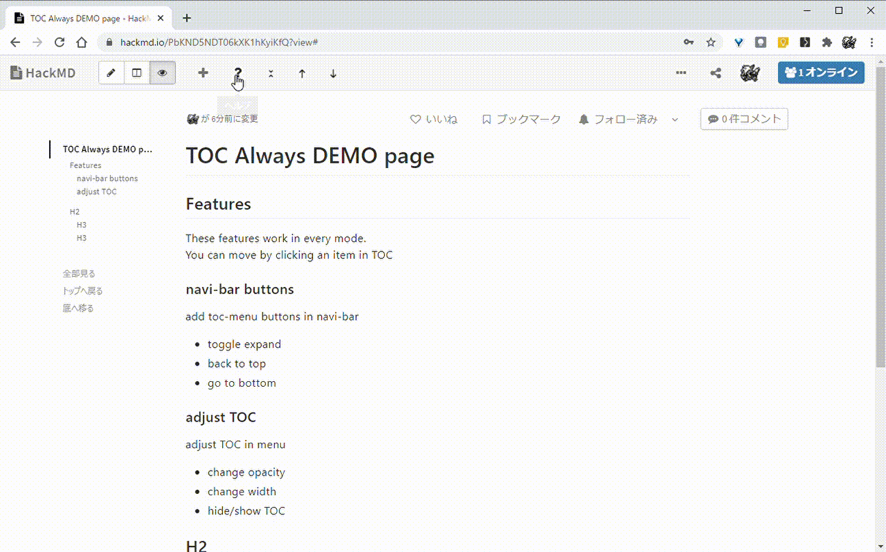
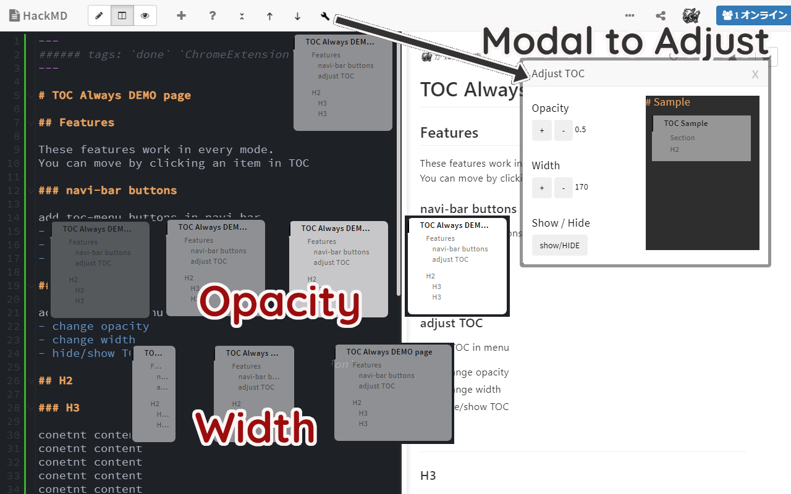

# HackMD_TOC_always

## Abstract

With this extension in HackMD, you can see TOC even in edit or split-view mode.



## Features
These features work in every mode.
You can move by clicking an item in TOC

### TOC Menu
TOC settings are integrated into HackMD's dropdown menu (top-right menu button):
- **Show/Hide TOC**: Toggle TOC visibility
- **TOC Settings**: Open settings dialog
    - Change opacity
    - Change width
    - Toggle expand/collapse




## Contact Me

- Gmail: TomoIris427+GitHub@gmail.com

## License

MIT

See [THIRD_PARTY_LICENSES.md](THIRD_PARTY_LICENSES.md) for third-party license information.

## Development

### Build

```bash
./scripts/build.sh
```

### Deploy

```bash
# Set DEPLOY_TARGET in .env
cp .env.example .env
# Edit .env and set DEPLOY_TARGET

./scripts/deploy.sh
```

### Project Structure

```
hackmd-toc/
├── src/                    # Source files
│   ├── manifest.json      # Extension manifest (Manifest V3)
│   ├── content_script.js  # Main logic (Vanilla JS)
│   ├── options.html       # Options page
│   └── options_script.js  # Options logic
├── scripts/               # Build & deploy scripts
│   ├── build.sh          # Build to dist/
│   └── deploy.sh         # Deploy to DEPLOY_TARGET
├── dist/                  # Build output (gitignored)
└── img/                   # Images
```

### Changes

#### v1.4.0 (2025-02-21)
- Generate TOC from headings (no longer depends on HackMD's existing TOC)
- Integrate TOC settings into HackMD's dropdown menu
- Fix selectors for current HackMD DOM structure
- Fix CSSStyleDeclaration error in setStyles function

#### v1.3.0 (2025-02-19)
- Migrate to Manifest V3
- Remove jQuery dependency (Vanilla JS rewrite)
- Update selectors for current HackMD DOM structure
- Add build and deploy scripts
