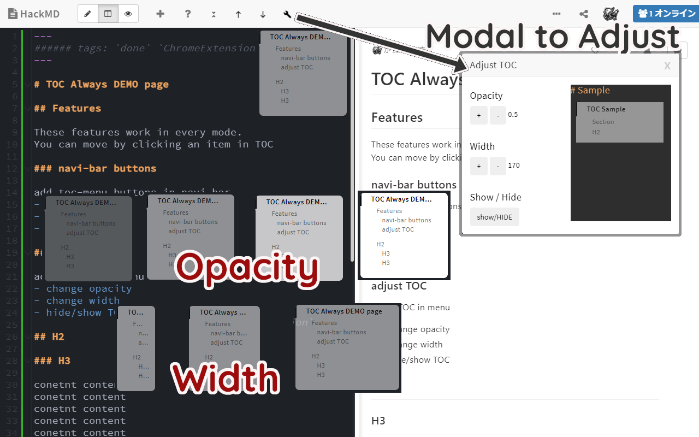

# HackMD_TOC_always

## Abstract

With this extension in HackMD, you can see TOC even in edit or split-view mode.

## Features
These features work in every mode.
You can move by clicking an item in TOC

### navi-bar buttons
add toc-menu buttons in navi-bar
    - toggle-expand / back-to-top / go-to-bottom / open-adjust-dialog

### adjust TOC
adjust TOC in a modal dialog which you can open in the navi-bar icon
- change opacity
- change width
- hide/show TOC

## Contact Me

- Gmail: TomoIris427+GitHub@gmail.com

## License

MIT
